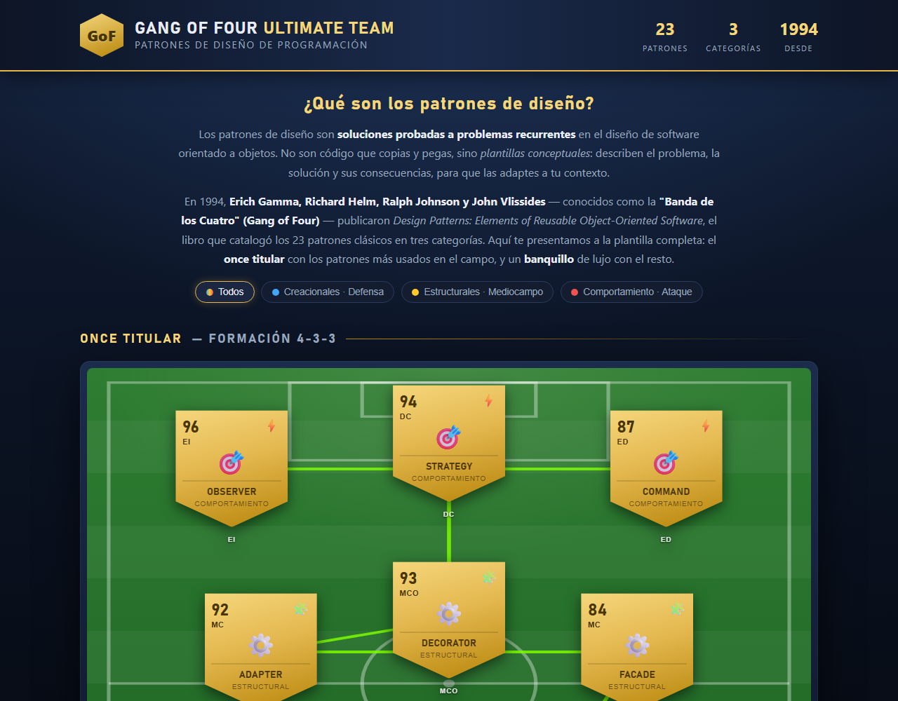

# ⚽ Gang of Four Ultimate Team

**Los 23 patrones de diseño del Gang of Four explicados con estética FIFA Ultimate Team.**

🔗 **Ver en vivo: [carlosh14.github.io/gof-ultimate-team](https://carlosh14.github.io/gof-ultimate-team/)**



## ¿Qué es esto?

Una página web educativa que presenta los patrones de diseño clásicos del libro
*Design Patterns: Elements of Reusable Object-Oriented Software* (Gamma, Helm, Johnson
& Vlissides, 1994) como si fueran una plantilla de FIFA Ultimate Team:

- **Once titular (4-3-3)** — los 11 patrones más usados, como cartas doradas sobre el campo:
  - 🧤 **Portero:** Singleton (solo puede existir una instancia bajo palos)
  - 🛡️ **Defensa:** los patrones **creacionales** (construyen la base del equipo)
  - ⚙️ **Mediocampo:** los patrones **estructurales** (conectan y organizan)
  - ⚡ **Ataque:** los patrones de **comportamiento** (actúan y comunican)
- **Banquillo** — los 12 patrones restantes, ordenados por rating.
- **Líneas de química** — conexiones verdes/naranjas entre patrones que se combinan a menudo.
- **Ficha de cada patrón** — al hacer clic en una carta: problema y solución, analogía
  (futbolística cuando encaja), **ejemplo ejecutable en Python** con resaltado de sintaxis,
  y 6 atributos tipo FUT (frecuencia, flexibilidad, testabilidad…).
- **Filtros por categoría** para resaltar creacionales, estructurales o de comportamiento.

## Ejecutar en local

Sin dependencias ni build — es HTML/CSS/JS puro:

```bash
python -m http.server 8321
# abre http://localhost:8321
```

## Estructura

```
├── index.html      # Página única: campo, banquillo y modal de detalle
├── css/styles.css  # Estética FUT: cartas doradas, campo, química, responsive
├── js/data.js      # Contenido de los 23 patrones (explicaciones + código Python)
└── js/app.js       # Render de cartas, líneas de química SVG, modal, filtros
```

---

Estilo inspirado en FIFA Ultimate Team (EA Sports). Página educativa sin ánimo de lucro.
